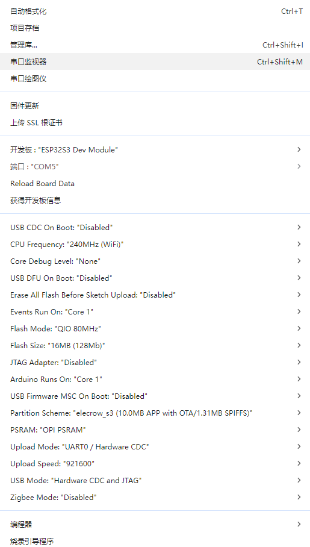

# ESP32-Watch

## 项目介绍

- ESP32-Watch 的测试固件代码。
- 需要和 ESP32-Watch 上位机搭配使用。

## 硬件部分

当前出货固件代码适用硬件版本为：V0.3、V0.4

## 使用介绍

当前出货固件代码适用上位机版本为：V1.0

## 开发环境

Arduino V2.3.6 及以上版本，选择ESP32 开发板 V3.3.3 版本

Arduino编译配置:

  

## 已实现功能

长按3s可上电开机，也可插入type-c供电开机。

开机后长按3s可关机，插入type-c供电后不能关机。

开机后显示白屏，短按功能按键会使得机器进入light sleep低功耗状态，可以屏幕触摸或者短按功能按键唤醒。

以下所有测试均需要使用上位机，或者在串口工具输入命令。
- 背光测试
- 显示测试
- 触摸测试，可以按顺序触摸
- 触摸画点
- 电池电量测试，打印直接测量电压和计算分压电阻后的电池电压
- 按键测试
- 震动马达测试
- 陀螺仪测试
- RTC时钟测试，会通过上位机获取电脑的时间并不断自增。
- 喇叭测试
- 麦克风测试，录音5s，然后通过喇叭播放
- 蓝牙测试，通过nRF Connect软件向ESP32-Watch发送数据
- wifi连接测试
- 自动测试
- 压力测试

